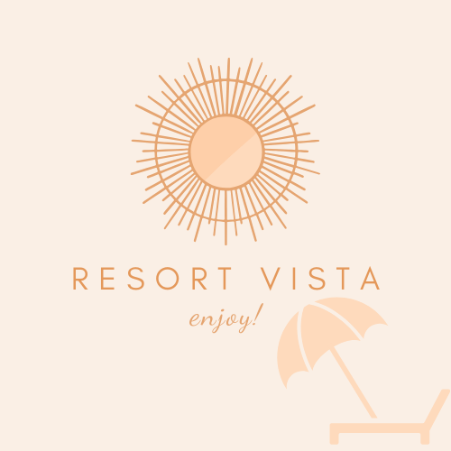

<a name="readme-top"></a>

<div align="center">
  <br/>
 
  <h1><b>Resort Vista</b></h1>
</div>

<!-- TABLE OF CONTENTS -->

## 📗 Table of Contents

- [🏝️ Resort Vista](#about-project)
  - [🛠️ Built With](#built-with)
     - [⚙️ Tech Stack](#tech-stack)
     - [🌟 Key Features](#key-features)
  - [🚀 Live Demo](#live-demo)
  - [🔗 Link for the Backend API](#backend)
  - [🔗 Kanban Board](#kanban)
  - [💻 Getting Started](#getting-started)
    - [Prerequisites](#prerequisites)
    - [Setup](#setup)
    - [Install](#install)
    - [Usage](#usage)
  - [👥 Authors](#authors)
  - [🔭 Future Features](#future-features)
  - [🤝 Contributing](#contributing)
  - [⭐️ Show Your Support](#️show-your-support)
  - [🙏 Acknowledgments](#acknowledgments)
  - [📝 License](#license)

<!-- ABOUT PROJECT -->

# Resort Vista <a name="about-project"></a>

**Resort Vista** is a web application built with a Ruby on Rails backend API and a React frontend UI, offering users a platform to explore and manage resort reservations. Whether you're planning a getaway or looking for a relaxing vacation spot, Resort Vista provides a seamless experience to discover, reserve, and manage your resort bookings.

## 🛠 Built With <a name="built-with"></a>

### Tech Stack <a name="tech-stack"></a>

- [Ruby on Rails](https://rubyonrails.org) - A powerful web application framework for the backend API.
- [React](https://reactjs.org) - A JavaScript library for building user interfaces on the frontend UI.
- [Redux](https://redux.js.org/) - A state management library for managing application state in the frontend.
- [PostgreSQL](https://www.postgresql.org) - An open-source relational database.
- [Bundler](https://bundler.io) - A tool for managing Ruby gem dependencies.

<!-- FEATURES -->

### Key Features <a name="key-features"></a>

- 🔐 **Splash Screen**: Begin your resort journey with confidence! The splash screen features secure authentication. Start your exploring with a captivating splash screen that invites you to log in or sign up.
- 🌏 **Explore Resorts**: Discover a curated selection of resorts, each offering unique experiences and amenities.
- ✔️ **Reserve Your Spot**: Reserve your desired fav resort.
- 📅 **Manage Reservations**: Effortlessly manage your resort bookings, including viewing details.
- 🖥️ **User-Friendly Interface**: Enjoy an user-friendly interface.

<p align="right">(<a href="#readme-top">back to top</a>)</p>

<!-- LIVE DEMO -->
## 🚀 Live Demo <a name="live-demo"></a>
- Soon.. [Live Demo Link](https://resortvista.onrender.com/)

<p align="right">(<a href="#readme-top">back to top</a>)</p>

<!-- BACKEND -->

## 🔗 Link for the Backend UI <a name="backend"></a>

- [Resort Vista Backend](https://github.com/meryemsanem/resort-back-end)

<p align="right">(<a href="#readme-top">back to top</a>)</p>

<!-- KANBAN -->

## 🔗 Kanban Board <a name="kanban"></a>

- [Kanban Board](https://github.com/meryemsanem/resort-back-end/projects/1)
- [Initial Kanban Board](https://user-images.githubusercontent.com/82718562/279994279-135a04c3-6cc8-4814-a12b-964653967c82.png)
- There are 4 member in our group.

<p align="right">(<a href="#readme-top">back to top</a>)</p>

<!-- GETTING STARTED -->

## 💻 Getting Started <a name="getting-started"></a>

To get a local copy up and running, follow these steps.

### Prerequisites

In order to run this project, you need to have the following installed:

- [Ruby on Rails](https://rubyonrails.org) - A powerful web application framework for the backend API.
- [Ruby](https://www.ruby-lang.org/en/) - The programming language used by Rails.
- [PostgreSQL](https://www.postgresql.org) - An open-source relational database.
- [Bundler](https://bundler.io) - A tool for managing Ruby gem dependencies.
- [Node.js and npm](https://nodejs.org) - JavaScript runtime and package manager for the frontend.

### Setup

Clone this repository to your desired folder:

```bash
git clone https://github.com/meryemsanem/resort-frond-end.git
```

### Install

Install this project with:

```bash
  cd resort-front-end
  npm install
```

it will install the required gemfile for running the project

### Usage

```bash
  npm start
```
The frontend will be available at `http://localhost:3000`.
<p align="right">(<a href="#readme-top">back to top</a>)</p>

<!-- AUTHORS -->

## 👥 Authors <a name="authors"></a>

👤 **Meryem Sanem Küçükbayram**

- GitHub: [Meryem Sanem Küçükbayram](https://github.com/meryemsanem)
- LinkedIn: [Meryem Sanem Küçükbayram](https://www.linkedin.com/in/meryemsanemkucukbayram/)

👤 **Abd elhakim Zayan**

- GitHub: [Abd elhakim Zayan](https://github.com/abdozayan12)
- LinkedIn: [Abd elhakim Zayan](https://www.linkedin.com/in/abdozayan/)


👤 **Yusuf Sholotan**

- GitHub: [Yusuf Sholotan](https://github.com/yin-ka)
- LinkedIn: [Yusuf Sholotan](https://www.linkedin.com/in/yusuf-sholotan/)

👤 **Clarence Atim**

- GitHub: [Clarence Atim](https://github.com/ClarenceAtim)
- LinkedIn: [Clarence Atim](https://www.linkedin.com/in/tegum-clarence-615b58200)

<p align="right">(<a href="#readme-top">back to top</a>)</p>

<!-- FUTURE FEATURES -->

## 🔭 Future Features <a name="future-features"></a>

- 🔎 **Search and Filter**: Allow users to search for resorts and filter by criteria such as fee, location, and more.

- 💬 **User Reviews**: Implement a user review system where visitors can leave reviews and ratings for resorts, helping others make informed decisions.


<p align="right">(<a href="#readme-top">back to top</a>)</p>

<!-- CONTRIBUTING -->

## 🤝 Contributing <a name="contributing"></a>

Contributions, issues, and feature requests are welcome!

Feel free to check the [issues page](https://github.com/meryemsanem/resort-front-end/issues).

<p align="right">(<a href="#readme-top">back to top</a>)</p>

<!-- SUPPORT -->

## ⭐️ Show your support <a name="support"></a>

If you find Resort Vista helpful or interesting, show your support by starring this repository on GitHub. Your stars let us know that you appreciate our work and find value in the project. ⭐️


<p align="right">(<a href="#readme-top">back to top</a>)</p>

<!-- ACKNOWLEDGEMENTS -->

## 🙏 Acknowledgments <a name="acknowledgements"></a>

This project's design is inspired by the work of Murat Korkmaz on Behance.Therefore, we express our gratitude to Murat Korkmaz for the inspiring design that contributes to the visual appeal of Resort Vista.

Thank you for the incredible design inspiration! 🙏

- **Behance:** [Murat Korkmaz](https://www.behance.net/muratk)
<p align="right">(<a href="#readme-top">back to top</a>)</p>

<!-- LICENSE -->

## 📝 License <a name="license"></a>

This project is [MIT](./LICENSE) licensed.

<p align="right">(<a href="#readme-top">back to top</a>)</p>
